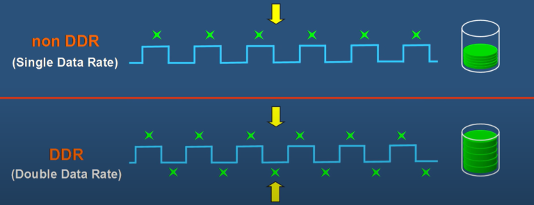

- **SDRAM** (Synchronous Dynamic Random Access Memory)
- **DDR** or DDR SDRAM (Double Data Rate)
    - Sends two operations in one signal
    
- **LPDDR** (Low Power)
    - Used in mobile devices and Apple Macbook's. From 2015 as fast as DDR but more energy efficient