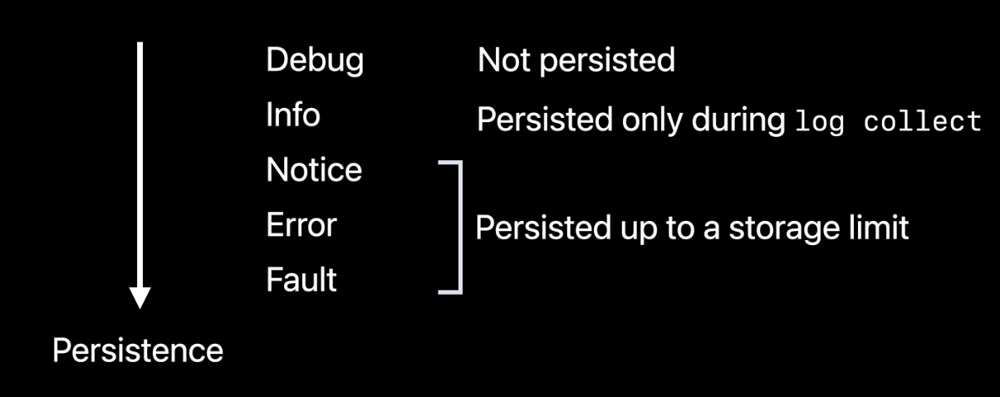

> Available from `iOS 14`

### Logged Types

Types that can be logged:

- simple types (`Int, Double`, etc.)
- types that conforms to `CustomStringConvertible`

### [Log Levels](Logging/Log%20Levels.md)




[Log Levels](Logging/Log%20Levels.md)

## Usage

```swift
import os

let logger = Logger(subsystem: "com.some.app", category: "app_feature")

logger.log("log")
```

### Formatting

- Formatting data has no cost at runtime
    
    ```swift
    logger.log("\(data, format: .hex, align: .right(columns: width))")
    ```
    


## Collecting Logs

```bash
# collect logs from device from specific date and write in in `app.logarchive`
log collect --device --start '2020-06-10 9:41:00' --output app.logarchive
```

## Resources

[Log Messages](https://developer.apple.com/documentation/os/logging/generating_log_messages_from_your_code)

[Explore logging in Swift - WWDC20 - Videos - Apple Developer](https://developer.apple.com/videos/play/wwdc2020/10168/)