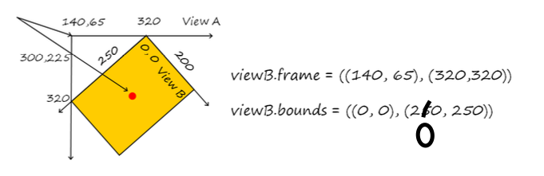

- `view.layer.presentation()?.frame`
	- we can retrieve *position* of view *during the animation*

## Frame, bounds etc.

**Animatable properties**: frame, bounds, center, transform, alpha, backgroundColor (that have some continuous value, not discrete (e.g. hidden))

This actions triggers a view update:

- Moving views that overlays our view
- Changing **hidden** property
- Scrolling view out of screen and back
- Explicit call of **setNeedsDisplay**: or **setNeedsDisplayInRect**:

UIView has no intrinsic content size 

**Bounds** - границы самого элемента (т.е координаты относительно самого себя)

**Frame** - граница рамки ограничивающий элемент (т.е координаты относительно родительского вью или наименьший прямоугльник в который можно вписать view)

## Interaction with view

`userInteractionEnabled` (UIE)- штука отвечающая за принятие экшиона у view 

Set to `false` in all subclasses of `UIView` except `UIControl`

## View render

`setNeedsDisplay()` - redraw of view (call `draw(in:)`) on the next update cycle