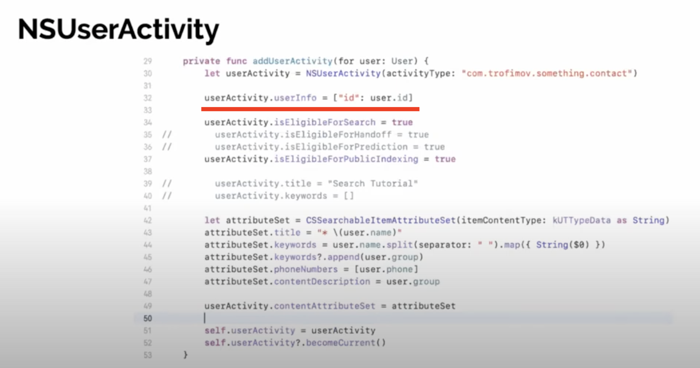

# Spotlight

**CoreSpotlight** and **NSUserActivity** looks similar for user but for developer they got different purposes

**CoreSpotlight** - for indexing some private data, that do not relies on user actions, we can manipulate indexes

**NSUserActivity** - use it when you want so save some kind of state, we can’t manipulate indexes




.png).png)

When you choose to index an item publicly, a hash of the indexed item is sent to Apple's servers. When other user's devices start sending the same hash to Apple's servers, Apple will begin recognizing your indexed item as useful, or important. Note that having many users send the same item once doesn't mean much to Apple. They are looking for indexes items that are accessed regularly by each user.

```swift
let userActivity = NSUserActivity(activityType: "com.donnywals.example")
userActivity.title = "This is an example"
activity.persistentIdentifier = "example-identifier"
userActivity.isEligibleForSearch = true // add this item to the Spotlight index
userActivity.isEligibleForPublicIndexing = true // add this item to the public index
userActivity.becomeCurrent() // making this the current user activity will index it
```

Attributes for a CSSearchableItem are defined in a CSSearchableItemAttributeSet. An attribute set can contain a ton of metadata about your content. You can add start dates, end dates, GPS coordinates, a thumbnail, rating and more. Depending on the fields you populate, iOS will render your indexed item differently. When you add content to Spotlight, make sure you provide as much content as possible.

```swift
import CoreSpotlight // don't forget to import CoreSpotlight at the top of your file
import MobileCoreServices // needed for kUTTypeText

let attributes = CSSearchableItemAttributeSet(itemContentType: "com.donnywals.favoriteMovies")
attributes.title = indexedMovie.title
attrs.contentType = kUTTypeText as String
attributes.contentDescription = indexedMovie.description
attributes.identifier = indexedMovie.id
attributes.relatedUniqueIdentifier = indexedMovie.id
```

Because you can index items through both NSUserActivity and CSSearchableItem, you need a way to tell Spotlight when two items are really the same item. You can do this bu setting the searchable attributes' relatedUniqueIdentifier to the same value you'd use for the user activity's persistentIdentifier property.

 When you add a new item to `Spotlight`, make sure to assign a value to `contentType`