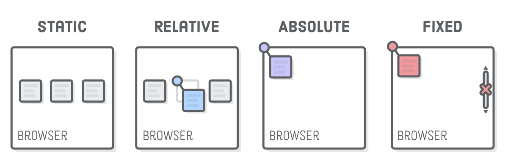

The CSS `position` property lets you alter the positioning scheme of a particular element. Its default value, as you might imagine, is static. When an element’s `position` property doesn’t have a value of static, it’s called a “positioned element”

Coordinates for absolute elements are always relative to the closest container that is a positioned element. It only falls back to being relative to the browser when none of its ancestors are positioned