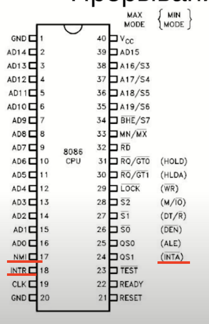

[CPU](CPU.md)  умеет только **три вещи:**

1. Читать из памяти
2. Выполнять арифметическую операцию
3. Записывать что-то в память

**Перфокарта и/или перфолента** - ничто иное как устройство ввода/вывода, тк на нее записывалось состояние памяти, а затем это состояние мапилось на саму память (до изобретения этого механизма все вводилось в память вручную 😬) а затем выводилось на пустую перфокарту/ленту или на что-то другое (типа принтера).

**Операционная система** - ничто иное как программа которая выполняет все рутинные действия по работе с памятью, устройствами ввода и тп.

Между ОС и программами существует четкое разделение на User Space и Kernel Space. User Space - место где выполняются все наши программы и выполняются вызовы этими программами в Kernel Space. Kernel Space - место где уже эти вызовы выполняются системой.

**Системный вызов** - специальное программное прерывание.

**Драйвер** - программа которая абстрагирует общение с определенным устройством до простых операций (read, write etc.)

Ядро ОС занимается:

- Обработкой запросов приложений
- Обработка запросов оборудования
- Диспечеризация процессов (scheduling)
- Обработка эксепшенов

**Процесс** - своеобразный абстрактный компьютер (те имеет свое адресное пространство, свой стек и тд)

**Поток (thread)** - это единица исполнения в процессе (те процесс это как окружение для потоков, которые в свою очередь используют его ресурсы для вычисления, например память). Но это определение не совсем точное, тк процессы тоже могут шарить общие ресурсы (пример команда системный вызов `clone`)

Те сам себе процесс ничего не исполняет и в нем есть хотя бы один поток

## **Прерывания**

**Прерывания** - единственный способ сказать процессору остановиться от выполнения текущей задачи и заставить его выполнить что-то другое. Прерывания хранятся в области памяти которая называется таблице прерываний. Таблица хранить в себе указатели на обработчики прерываний - процедуры которые должны выполнятся при появлении определённого прерывания. Самый простой пример прерывания - таймер.

Прерывания - часть hardware. Например у процессора 8086 есть специальная нога на NMI (Non maskable interrupt) при подачи на которую напряжения процессор сразу же переходит на обработку прерывания. ЧТо делать если система уже выполняет другое прерывания и ей пришло очередное прерывание? У процессора есть еще дополнительные ноги: INTR и INTA. INTR (interrupt request) отвечает на вопрос: выполняет ли процессор сейчас какое-то прерывание?.

INTA (interrupt acknowledgement) сигнализирует о том что процессор закончил выполнение прерывания. Те процесс выглядит так: устройство спрашивает у INTR выполняется ли прерывание: если нет, то выполняется запрошенное прерывание, если да то ждет подачи соответствующего сигнала на INTA и после того как туда приходят сигнал, что текущее прерывание закончило выполнение - выполняется запрошенное.

Для обработки прерывания от большого количества устройств используется **контроллер прерываний** у которого есть много ножек подключения но сам он использует у процессора вот эти три и сам менеджер как и в каком порядке вызывать поступающие запросы на прерывания.

Чтобы ОС можно называть ОС она должна выполнять минимум три функции:

- Управление многозадачностью
- Управление памятью
- Обеспечение межпроцессного взаимодействия

Когда компьютер включается происходит следующее:

1. Читается область памяти называемая POST (power on self test). Это набор команд зашитых в память отвечающих за проверку целостности системы. Грубо говоря это набор юнит тестов для железа.
2. Запускается BIOS (basic input output system). Маленькая ОС которая знает только про ввод вывод (никаких абстракций процессов, файлов и тд). Единственной задачей является найти с какой persistent storage загрузить основную ОС. После этого BIOS загружает первый фиксированный блок памяти с этого места и передает ему управления. Этот блок должен содержать **загрузчик**, который должен знать как дальше собрать и загрузить ОС.
3. После загрузки сознается первый изначальный процесс. Но через филированный квант времени (через таймер - специальную микросхему) будет вызван **планировщик**. Планировщик занимается тем что решает какой процесс будет выполняться на CPU.