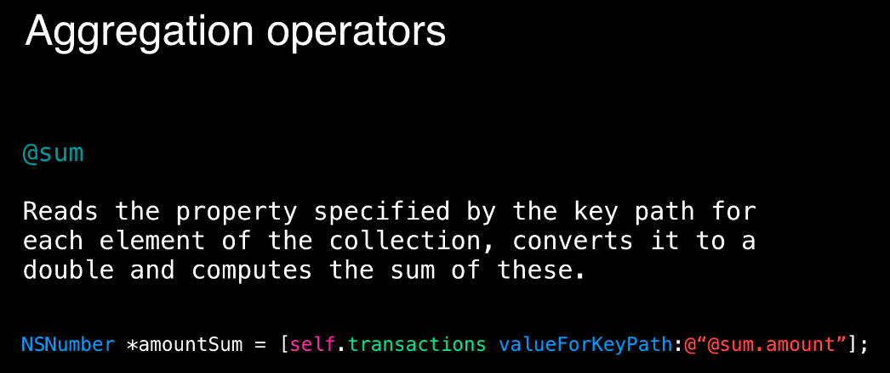

# KVC

# KVC

Key-Value Coding

Allows us to set properties (for example set a private property for class If we know it’s name). We should be careful cause if not found - app will crash

`Person *a = [Peson new];`

`[a setValue:@"lol" forKey:@"name"] // setting lol for property name`

Also allows as to make some operations on collections (for example find sum of properties values)

