# Properties

They are used to access `ivars` (i.e. Instance Variable)

_NSString_property.png)_NSString_property.png)

Compiler generates next access methods for generated ivar where value will be stored

property.png)property.png)

This is default naming for this access methods but they can be changed by adding next attributes

So now compiler will generate this

setMyProperty_(NSString_)property.png)setMyProperty_(NSString_)property.png)

If we override this to methods compiler **WILL NOT** generate ivar for us.

***@synthesize*** is used to connect our property with a different ivar instead of ivar generated by compiler

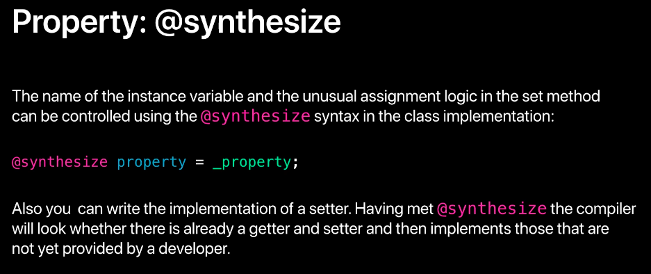

***@dynamic**** *is used to say to compiler not to generate ivar and access methods (i.e. getter and setter)

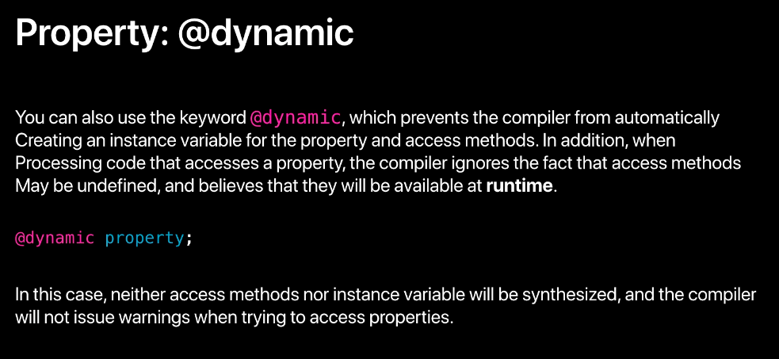

**!DO NOT ACCES PROPERTIES IN INIT AND DEALLOC!**  **** Use ivars instead  ****  **** Because:

1. You can accidentally access uninitilized parts of program
2. Logic under properties can be complicated and slow when init and dealloc should be instantaneous

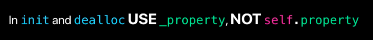

## Properties attributes

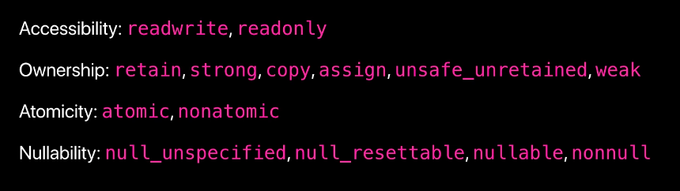

**readwrite (by default)**

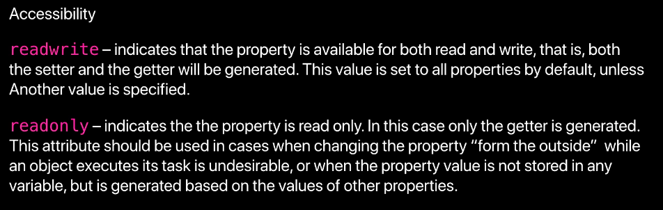

_-_means_that_the_accessor_and_the_mutator_will_be_generated_in_such_way.png)_-_means_that_the_accessor_and_the_mutator_will_be_generated_in_such_way.png)

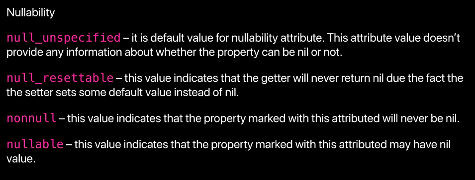

**Properties can’t be used into Categories** (because they are generated at ***runtime*** when property access methods at ***compile time***)

Also that can’t be done because after compilation we know object size and if we add something at the runtime size can be undefined.

## Memory ownership attributes (MRC)

There are 3 main attributes of memory ownership in MRC:

- ***assign***
- ***retain***
- ***copy***

## Assign

- Prevent from retain cycle
- Work with primitives i.e ***int, double*** etc.
    
    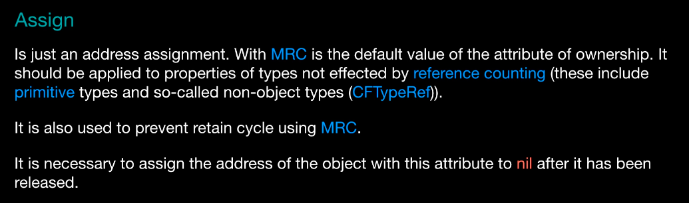
    

_NSInteger_number.png)_NSInteger_number.png)

## Retain

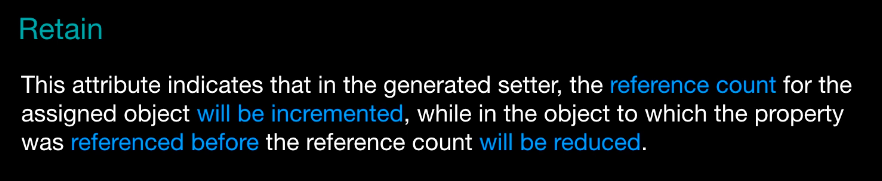

Retain here before release in case we pass to property object that already in property (so if we do release first we can get a crash if reference count gos to zero)

_NSNumber_salary.png)_NSNumber_salary.png)

In case our property marked as ***retain*** we always should release object in ***dealloc***

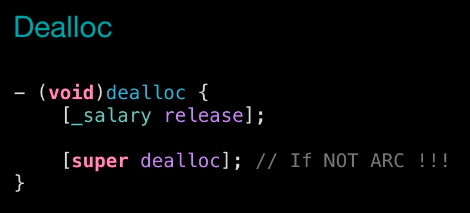

## Copy

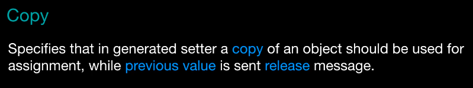

_NSString_name.png)_NSString_name.png)

## Memory ownership attributes (ARC)

There are 3 main attributes of memory ownership in ARC:

- ***strong***
- ***weak***
- ***unsafe_unretained***

## Strong

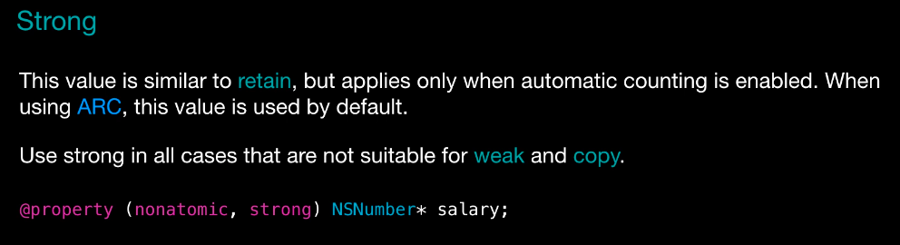

## Weak

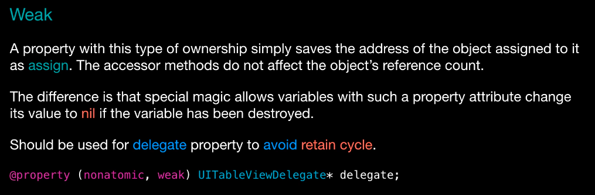

## Unsafe_unretained

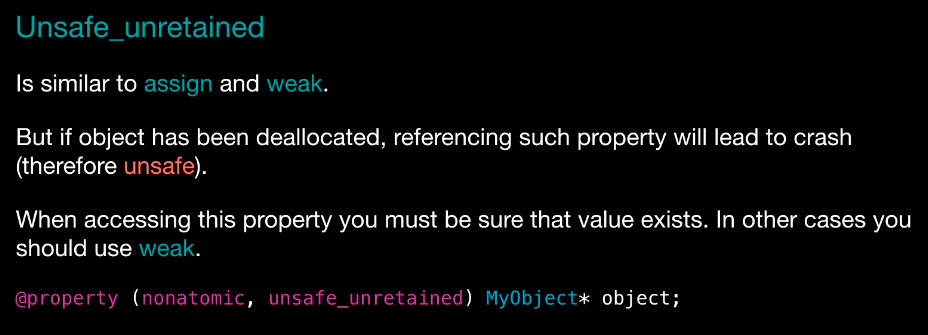

**In ARC you can’t use MRC attributes but in MRC you can use ARC attributes**