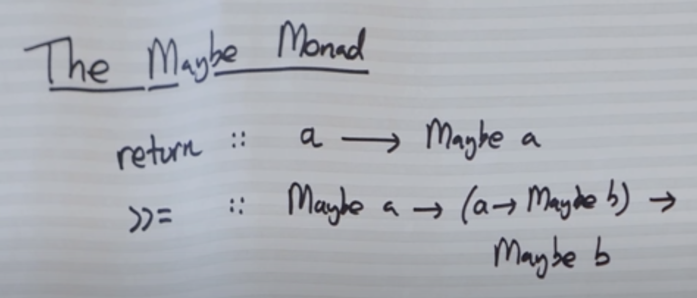

- **Links**
	- [(89) A monad is a monoid in the category of endofunctors. Whats the problem? #SoMe2 - YouTube](https://stackoverflow.com/questions/44965/what-is-a-monad)

**Monad** - something that have two operations: operation on turning pure type into monad and operation of sequencing monad's



Maybe monad in [Swift](../../Swift.md) is [Optionals](../../Swift/Swift%20Notes/Optionals.md) 

```swift
let a: Int? = 3 // return operation Int -> Optional<Int>
a.map { $0 == 3 ? false : true } // map operation Optional<Int> -> (Int -> Bool) -> Optional<Bool>
```
