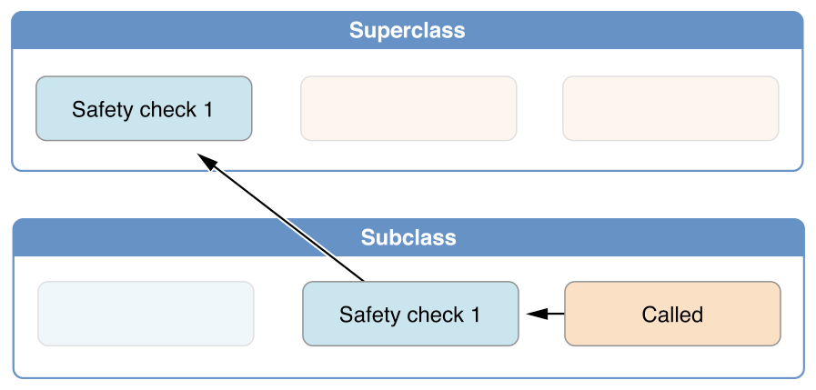

## Phases

Two phases of initialization

1. First phase
    
    
    
    - calling of `designed` init or `convenience`
    - initializing `self` properties with values
    - calling design initializer of parent class
    - do it for all inheritance chain
2. Second phase
    
    
    
    - From top of inheritance chain configure inherited properties

## Rules

- All of the properties introduced by class must be initialized before it delegates up to a superclass initializer (due to init phases)
    
    ```swift
    class A {
    		var property = 1
    }
    
    class B: A {
        let selfProperty: Int
        
        override init() {
            super.init()
            self.selfProperty = 3 // error
        }
    }
    
    class C: A {
        let selfProperty: Int
        
        override init() {
            self.selfProperty = 3 // ok
            super.init()
        }
    }
    ```
    
- Designated initializer must delegate up to a superclass initializer before assigning a value to an inherited property
If it doesn’t, the new value the designated initializer assigns **will be overwritten by the superclass as part of its own initialization**
    
    ```swift
    class B: A {
        let selfProperty: Int
        
        override init() {
            self.selfProperty = 3
            self.property = 4 // erorr
            super.init()
        }
    }
    ```
    
- A convenience initializer must delegate to another initializer before assigning a value to any property (including properties defined by the same class
    
    If it doesn’t, the new value the convenience initializer assigns **will be overwritten by its own class’s designated initializer**
    
    ```swift
    class B: A {
        var selfProperty: Int
        
        override init() {
            self.selfProperty = 4
        }
        
        convenience init(val: Int = 3) {
            selfProperty = val // error
            self.init() 
        }
    }
    ```
    
- An initializer cannot call any instance methods, read the values of any instance properties, or refer to `self` as a value **until after the first phase of initialization is complete**
    
    ```swift
    class B: A {
        var selfProperty: Int
        
        override init() {
            self.selfProperty = 4
            printSelfProperty() // error
            super.init()
        }
        
        func printSelfProperty() {
            print(selfProperty)
        }
    }
    
    class B: A {
        var selfProperty: Int
        
        override init() {
            self.selfProperty = 4
            super.init()
            printSelfProperty() // ok
        }
        
        func printSelfProperty() {
            print(selfProperty)
        }
    }
    ```
    

## Implicit call of `super.init()`

- no need to customize inherited propertirs
- superclass designed init has no arguments

```swift
class A {
		var property = 1
}

class B: A {
    let selfProperty: Int
    
    override init() {
        self.selfProperty = 3
				// super.init() implicitly called here
    }
}
```

## When inits are inherited

- If your subclass **doesn’t define any designated initializers**, it a**utomatically inherits all of its superclass designated initializers**
    
    ```swift
    class A {
        var property: Int
        
        init() {
            property = 1
        }
        
        init(with value: Int) {
            property = value
        }
    }
    
    class B: A {}
    
    B()
    B(with: 3)
    ```
    
- If your subclass provides an implementation of all of its superclass designated initializers - either by inheriting them as per rule 1, or by providing a custom implementation as part of its definition - then it automatically **inherits all of the superclass convenience initializers**
    
    ```swift
    class A {
        var property: Int
            
        init(with value: Int) {
            property = value
        }
        
        convenience init() {
            self.init(with: 3)
        }
    }
    
    class B: A {}
    
    let b = B()
    print(b.property) // 3
    ```
    
    ```swift
    class A {
        var property: Int
            
        init(with value: Int) {
            property = value
        }
        
        convenience init() {
            self.init(with: 3)
        }
    }
    
    class B: A {
        override init(with value: Int) {
            super.init(with: value)
        }
    }
    
    let b = B()
    print(b.property) // 3
    ```