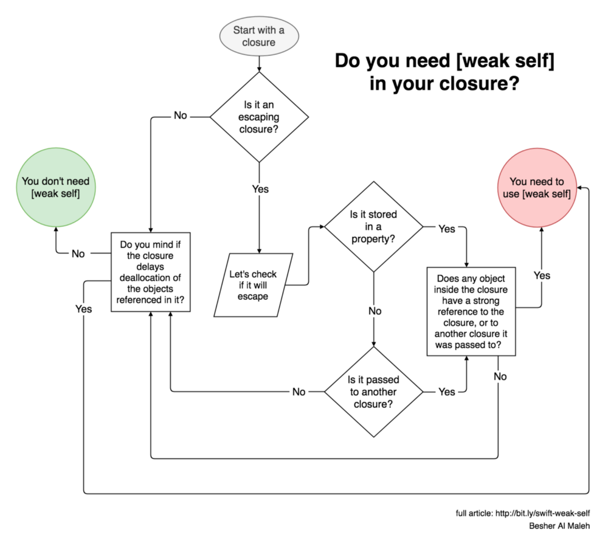

- **Notes**
	- We can use only [ARC](../../../Apple%20Technologies/Apple%20Platform%20Specifics/Reference%20Counting.md) in [Swift](../../../Swift.md)
- **Links**
	- [Unbreakable reference cycles in Swift no one is talking about | Max Desiatov](https://desiatov.com/swift-reference-cycles/)
	```swift
	struct I {
		var x = 0
		var increment: (() -> Void)?
	}
	var i = I()
	i.increment = { i.x += 1 } // ⚠️ retain cycle, due to reference to `i` and in case of struct it's not possible to create not strong reference here

	i.increment = nil // ony manual fix is possible
	```
```swift
// in ViewController
let someClosure = { 
	self.doStuff() // self is captured here ! retain cycle 
}

let someClosure = { [weak self] in
	// temporary reference that will be destroyed after leaving scope
	guard let self = self else { return } 
	self.doStuff() // no retain cycles
}
```

