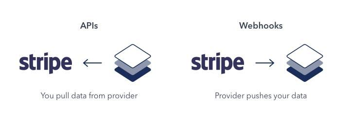

- **Notes**
	- 
	- With an API, you get data through a process known as “polling.” This is when your application periodically makes a request to an API server to check for new data.
	- A `webhook`, on the other hand, allows the provider to send (i.e “push”) data to your application as soon as an event occurs. This is why `webhooks` are sometimes referred to as “reverse API”
	- To receive events your app need a `webhook-url`
	- So its need to be an `http` based thing (some kind of server)
- **Links**
	- 