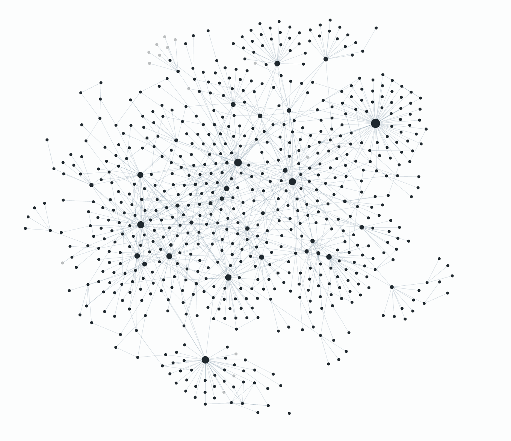

# 🧠 My Knowledge Base

 

Hi everyone! This is my knowledge base. It's a collection of almost **everything I know**. I started writing these notes in 2018 and continue to improve them almost every day. 

In the beginning I wrote everything in *Notion*, then I switched to *Apple Notes* and after a few years of staying with Apple I switched back to Notion. In 2021 I moved to [Obsidian](Index/Obsidian.md) and for now I am pretty happy with it. Looking forward to use just regular [Markdown](Index/Markdown.md) files and my favorite text editor - [Sublime Text](Index/Information%20Technology/Programming/Tools/Sublime%20Text.md)

Special thanks to [Nikita](https://github.com/nikitavoloboev) for inspiring me to do this thing in the first place.

[🧭 Start to explore](Index.md)